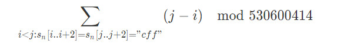

# J - Jesus Is Here

> 题目链接：[https://nanti.jisuanke.com/t/29129](https://nanti.jisuanke.com/t/29129)
>
> 题解作者：[DeAllen](https://github.com/AllenTaken)

## 题意

一串字符串序列，s[1]="c"，s[2]="ff"，s[i]=s[i-2]+s[i-1],	给定n，求



## 解析

n是2e6，可以递推上去，我的公式这样的

```c++
ans[i]=(ans[i-1]+ans[i-2]+rsum[i-1]*num[i-2]+num[i-1]*( (x*num[i-2]+sum[i-2])));
```

emmm这个公式，不怎么想解释

先把每个串翻转一下，就变为

c

ff

ffcff

ffcffffc

ffcffffcffcff

翻转后的结果不变，因为求的是距离。这里就变为每次加一个后缀，求'c'间的距离和。

ans数组代表要求的数；num数组代表串中c的数量，符合斐波那契；sum数组以第一个c为端点，和其它c的距离总和;rsum数组代表以最后一个c为端点，和其它c距离的总和。x代表第i串中，由i-1和i-2两个串拼接后，两子串c最邻近的间隔，可知i为奇数间隔5，i为偶数间隔3

sum和rsum的求法：

    sum[i]=((sum[i-1]+sum[i-2]) +(dis[i-1]+x)*num[i-2]);
    rsum[i]=((rsum[i-1]+rsum[i-2]) +(dis[i-2]+x)*num[i-1]);
dis代表该串第一个c和最后一个c的距离差。

其实第一个递推公式的实质就是，新串距离和是两个子串距离和加上两边交叉的距离。

嗯，就是这样。

## 神奇代码

```c++
#include <bits/stdc++.h>
using namespace std;

#define io_speedup ios::sync_with_stdio(0);cin.tie(0);cout.tie(0);
#define ll long long
#define f(i,a,b) for(i=a;i<=b;++i)
#define rf(i,a,b) for(i=a;i>=b;--i)
#define mem(a,n) memset(a,n,sizeof(a))
#define copy(a,b) memcpy(a,b,sizeof(b))
const long long INF=~(1<<31);

const double E=exp(1.0);
const double Pi=4*atan(1.0);

const long long N=3e6+5;
long long ans[N];
long long num[N];
long long sum[N];
long long dis[N];
long long rsum[N];
long long md=530600414;

int main()
{
    io_speedup
    long long n;
    n=N;
    long long i, j;
    num[3]=num[4]=1;
    f(i,5,n)num[i]=(num[i-1]+num[i-2])%md;
    sum[3]=sum[4]=0;
    dis[3]=dis[4]=0;
    f(i,5,n){
        long long x;
        x=i&1?5:3;
        dis[i]=(dis[i-1]+dis[i-2]+x)%md;
    }
    f(i,5,n){
        long long x=i&1?5:3;
        sum[i]=((sum[i-1]+sum[i-2])%md +(dis[i-1]+x)*num[i-2] %md)%md;
        rsum[i]=((rsum[i-1]+rsum[i-2])%md +(dis[i-2]+x)*num[i-1] %md)%md;
    }
    ans[3]=ans[4]=0;
    f(i,5,n){
        long long x=i&1?5:3;
        ans[i]=(ans[i-1]+ans[i-2]+rsum[i-1]*num[i-2]%md+num[i-1]*( (x*num[i-2]%md+sum[i-2])%md  )%md)%md;
    }
    long long T;
    cin>>T;
    long long t=T;
    while(T--){
            cin>>n;
        cout<<"Case #"<<t-T<<": ";
        cout<<ans[n]<<endl;
    }
	return 0;
}

```