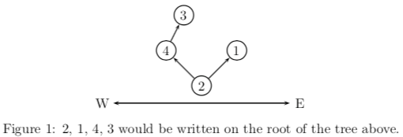

# H - Elven Postman  

> 题目链接：[https://nanti.jisuanke.com/t/29335](https://nanti.jisuanke.com/t/29335)
>
> 题解作者：[DeAllen](https://github.com/AllenTaken)

# 题意

按dfs序给定一颗二叉树，求任意一点的位置

## 解析

理解题意即可



编号大靠West，编号小的靠East，2134就是上面这棵树，1的位置是E，3的位置就是WE，4的位置是W

构造树的时候，记录每个节点左右节点的编号，从根节点搜索，如果比当前节点小就向East走，如果大就向West方向走，知道找到新的编号

查找同理

## 代码

```c++
#include <bits/stdc++.h>
using namespace std;

#define io_speedup ios::sync_with_stdio(0);cin.tie(0);cout.tie(0);
#define ll long long
#define f(i,a,b) for(i=a;i<=b;++i)
#define rf(i,a,b) for(i=a;i>=b;--i)
#define mem(a,n) memset(a,n,sizeof(a))
#define copy(a,b) memcpy(a,b,sizeof(b))
const int INF=~(1<<31);

const double E=exp(1.0);
const double Pi=4*atan(1.0);
const int N=1005;
struct tree{
    int west,east,father;
    int num;
}a[N];
int cnt;

void solve();

int main()
{
    io_speedup
    int n;
    cin>>n;
	while(n--){
        solve();
	}
	return 0;
}
void dfs(int i,int x){
    if(a[i].num==-1){
        a[i].num=x;
    }
    else if(x<a[i].num){
        if(a[i].east==-1)
            a[i].east=++cnt;
        dfs(a[i].east,x);
    }
    else if (x>a[i].num){
        if(a[i].west==-1)
            a[i].west=++cnt;
        dfs(a[i].west,x);
    }
}

void dir(int i,int x){
    if(a[i].num==x)
        return;
    if(x<a[i].num){
        cout<<'E';
        dir(a[i].east,x);
    }
    else if(x>a[i].num){
        cout<<'W';
        dir(a[i].west,x);
    }
}

void solve(){
    int n;
    cin>>n;
    int i,j;
    int root=0;
    f(i,0,N-1){
        a[i].num=a[i].west=a[i].east=a[i].father=-1;
    }
    cnt=0;
    f(i,0,n-1){
        int x;
        cin>>x;
        dfs(root,x);
    }
    int k;
    cin>>k;
    f(i,1,k){
        int x;
        cin>>x;
        dir(root,x);
        cout<<endl;
    }
}


```


